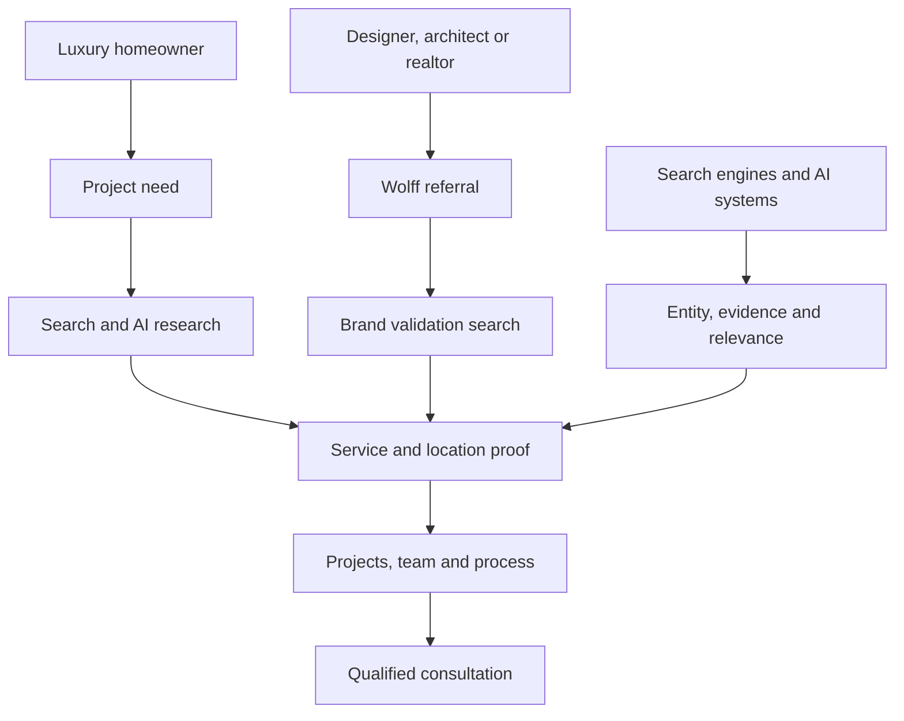

# Wolff Construction 90 Day SEO Plan

## Working assumptions

We are assuming Wolff wants:

1. Fewer but more valuable residential projects.

2. Luxury remodeling and custom residential construction.

3. Projects in Rocklin, Granite Bay, and surrounding high value communities.

4. Customers who care about quality, planning, communication, and long term value.

5. More opportunities from search, Google Maps, AI recommendations, referrals, designers, architects, and realtors.

These assumptions will be confirmed during kickoff, but they are strong enough to build the first plan.

# 1. Core Projects Wolff Sells

## Primary projects

1. Whole home renovations

2. Luxury kitchen remodeling

3. Luxury bathroom remodeling

4. Home additions

5. Accessory dwelling units

6. Custom homes

## Supporting capabilities

1. Structural modifications

2. Permit management

3. Preconstruction planning

4. Design coordination

5. Project management

6. Interior reconfiguration

7. Long term home improvements

The current website does not organize these into a clear service system. Most of the search relevance sits inside Granite Bay blog articles instead of strong permanent service pages.

# 2. Service Area

## Primary market

1. Rocklin

2. Granite Bay

3. Roseville

4. Loomis

## Secondary market

1. Auburn

2. Folsom

3. El Dorado Hills

4. Placer County

5. El Dorado County

The first 90 days should concentrate on Rocklin and Granite Bay. Roseville and Loomis should follow once the core service and project pages are established.

The homepage must define the complete market. Individual service and project pages can target the cities most relevant to the work shown.

# 3. Partners and Referral Sources

Wolff’s partner network is part of the customer acquisition system.

## Professional partners

1. Interior designers

2. Architects

3. Realtors

4. Kitchen and bath designers

5. Cabinet companies

6. Material suppliers

7. Trade representatives

8. Engineers

9. Specialty subcontractors

## Industry organizations

1. NARI

2. NKBA

3. CSLB

4. BuildZoom

5. Houzz

## Known relationship opportunity

Nar Design Group appears in Wolff’s review and referral history. That relationship should be verified and potentially developed into:

1. A shared project page

2. A partner profile

3. A project credit

4. A website link

5. A design collaboration story

6. A referral asset both companies can share

## Why partners matter

The best Wolff customer may never discover the company directly.

A designer, architect, realtor, past client, or supplier may recommend Wolff. The customer then searches the company name.

The website must confirm that the referral was a good recommendation.

# 4. Customer and Search Knowledge Graph



The same information serves three different audiences:

1. The homeowner deciding whether to contact Wolff.

2. The professional deciding whether to refer Wolff.

3. The search or AI system deciding whether Wolff is relevant and trustworthy.

# 5. What Clients Expect to See

## Business identity

Clients expect:

1. Correct company name

2. Rocklin location

3. Service area

4. Contractor license

5. Named founder

6. Named project team

7. Years in business

8. Professional memberships

9. Contact information

10. Real photographs

## Service fit

Clients expect to understand:

1. What Wolff builds

2. What project sizes Wolff accepts

3. Where Wolff works

4. Whether Wolff handles design coordination

5. Whether Wolff manages permits

6. Whether Wolff handles structural work

7. What the planning process involves

8. Whether their project is a good fit

## Project evidence

Clients expect:

1. Comparable completed projects

2. Project location

3. Project scope

4. Problems Wolff solved

5. Design and construction decisions

6. Project photographs

7. Customer feedback

8. Timeline guidance

9. Cost or investment context

10. The people responsible for the work

## Trust

Clients expect:

1. Detailed reviews

2. Professional referrals

3. Licenses and memberships

4. Clear process

5. Honest project expectations

6. Named staff

7. Consistent company information

8. Evidence that Wolff can manage a major residential investment

# 6. What Search Engines and AI Systems Expect

## Entity information

Search systems need to understand:

1. Which Wolff Construction this is

2. Where the company is located

3. Who owns it

4. Which license belongs to it

5. Which services it offers

6. Which markets it serves

7. Which profiles belong to the company

This is critical because another Wolff Construction operates in San Francisco.

## Relevance

Search systems need:

1. Dedicated service pages

2. Clear locations

3. Descriptive page titles

4. Useful headings

5. Connected project pages

6. Internal links

7. Consistent business information

8. Pages matching specific customer searches

## Evidence

Search and AI systems need:

1. Verified project details

2. Named experts

3. Detailed reviews

4. Contractor license information

5. Association memberships

6. Third party profiles

7. Partner references

8. Original photographs

9. Specific answers

10. Consistent facts across multiple sources

# 7. Intent Alignment

## Intent 1: Find a contractor

Example searches:

1. Luxury remodeling contractor Granite Bay

2. Whole home renovation contractor Rocklin

3. Luxury kitchen remodeler Granite Bay

4. Home addition contractor Rocklin

### Pages needed

1. Service pages

2. Location pages

3. Google Business Profile

4. Relevant project pages

### Conversion

Qualified consultation

## Intent 2: Understand cost

Example searches:

1. Luxury kitchen remodel cost Granite Bay

2. Whole home renovation cost Placer County

3. Home addition cost Rocklin

4. ADU construction cost Rocklin

### Pages needed

1. Cost guides

2. Service pages with investment ranges

3. Project examples with scope context

### Conversion

Project fit form or planning consultation

## Intent 3: Understand the process

Example searches:

1. How long does a whole home renovation take?

2. Do I need an architect for a home addition?

3. Who manages permits for a remodel?

4. When should I hire a contractor?

### Pages needed

1. Process page

2. Planning guides

3. Frequently asked questions

4. Team pages

### Conversion

Planning consultation

## Intent 4: Compare contractors

Example searches:

1. Best luxury contractor Granite Bay

2. How to choose a remodeling contractor

3. Wolff Construction reviews

4. Wolff Construction Rocklin

### Pages needed

1. About page

2. Team pages

3. Testimonials

4. Project pages

5. License and membership information

6. Houzz and Google Business Profile

### Conversion

View projects, meet the team, or request a consultation

## Intent 5: Validate a referral

The customer already knows the company name.

They want to confirm:

1. This is the correct Wolff Construction.

2. Wolff works in their area.

3. Wolff handles their type of project.

4. The company is licensed.

5. The team is credible.

6. Similar customers trust them.

7. The work matches their expectations.

### Pages needed

1. Homepage

2. About page

3. Founder profile

4. Team profiles

5. Project pages

6. Testimonials

7. Contact page

## Intent 6: Get an AI recommendation

Example questions:

1. Who are the best luxury remodeling contractors in Granite Bay?

2. Which Rocklin contractor handles major residential renovations?

3. Who builds high end kitchens in Placer County?

4. Which contractor handles design, permits, and construction?

### Information needed

1. Clear company identity

2. Defined services

3. Defined service area

4. Named experts

5. Project evidence

6. Direct answers

7. External citations

8. Structured data

9. Reviews

10. Consistent third party profiles

# 8. Website Findings in the Right Context

The crawl contained 27 URLs.

## Main findings

1. Ten pages use the title “Wolff Construction.”

2. Eleven pages use the same generic description.

3. The blog uses the careers title and description.

4. One internal construction URL returns a 404.

5. Three project pages contain fewer than 90 words.

6. The strongest search content focuses almost entirely on Granite Bay.

7. The homepage does not establish the full service area.

8. The website has no clear service page system.

9. Blog articles perform the job that service pages should perform.

10. Team pages have very few internal links.

11. Projects, services, team members, reviews, and locations are not connected into one customer journey.

These are not random SEO errors.

They prevent clients and search systems from understanding:

1. What Wolff sells

2. Where Wolff works

3. Which projects Wolff wants

4. Why Wolff is different

5. Which company entity is correct

6. What a customer should do next

# 9. Put the Job Requirements in Context

## Develop and execute SEO strategies

This means connecting business goals, customer intent, project offers, search demand, and implementation.

It does not mean publishing generic articles every month.

## Keyword research and competitor analysis

This should determine:

1. What customers search before hiring

2. Which project categories have demand

3. Which competitors control those searches

4. What proof competitors provide

5. Which questions remain unanswered

6. Where Wolff has a credible advantage

## Build authoritative backlinks

For Wolff, this means:

1. Designer project links

2. Architect relationships

3. Realtor referrals

4. NARI and NKBA listings

5. Houzz

6. Suppliers and trade partners

7. Local design publications

8. Regional project features

It should not mean syndicated press releases or bulk link packages.

## Optimize titles, descriptions, schema, and internal links

These tasks organize the knowledge graph.

They connect Wolff’s services, people, projects, markets, reviews, and expertise so search systems can understand the business.

## Manage technical SEO

Technical SEO keeps the system usable and trustworthy.

It includes:

1. Indexing

2. Broken links

3. Canonicals

4. Page speed

5. Core Web Vitals

6. Structured data

7. Mobile experience

8. Social sharing images

9. Navigation

10. Release quality control

## Manage Google Business Profile

The profile should support the project strategy.

Services, reviews, photographs, posts, questions, and landing pages should focus on the projects Wolff wants.

## Monitor Search Console and Analytics

This should answer:

1. Which customers are finding Wolff?

2. What do they search?

3. Which pages earn visibility?

4. Which pages earn clicks?

5. Which visitors become qualified leads?

6. Which leads receive proposals?

7. Which projects close?

8. Which closed projects are profitable?

## Provide monthly reports

The report should not be a traffic slideshow.

It should show:

1. What changed

2. What was learned

3. Which customer intent improved

4. Which services gained visibility

5. Which pages failed to earn clicks

6. Which inquiries were qualified

7. What should be changed next

## Collaborate with content and development

This requires a controlled system for research, approval, implementation, testing, and publishing.

That is where GitHub, APIs, Codex, and Claude become useful.

# 10. Technical Stack

## Current platform

Wolff uses Duda.

Duda can handle:

1. Static pages

2. Blog posts

3. Metadata

4. Navigation

5. Internal links

6. Forms

7. Redirects

8. Images

9. Custom code

10. Structured data

11. Dynamic content through Collections

Duda does not provide SSH, FTP, a normal file system, or native GitHub deployment.

## Duda API

If Bullsai provides API access, we can automate:

1. Page metadata updates

2. Collection records

3. Structured project content

4. Service and location data

5. Schema generation

6. Repeated page changes

7. Content synchronization

8. Reporting and validation

If API access is not available, GitHub still stores the research, approved copy, data, schema, tests, and release history. Publishing can remain manual.

# 11. GitHub Structure

GitHub becomes the operating record.

```text
data
    services
    locations
    projects
    customers
    reviews
    partners
    people
    questions
    sources

strategy
    customer intent
    project priorities
    competitors
    channel plan
    site architecture

templates
    service pages
    project pages
    location pages
    answer pages
    team pages

schema
    organization
    contractor
    person
    service
    project
    breadcrumb

scripts
    data imports
    content checks
    schema validation
    broken link checks
    Duda updates
    reporting
```

# 12. Codex and Claude Workflow

## Codex

Use Codex to:

1. Analyze crawls and exports

2. Build API connections

3. Create structured data files

4. Generate page briefs from approved information

5. Implement changes

6. Build schema

7. Check internal links

8. Validate metadata

9. Create Duda update packages

10. Produce performance reports

## Claude

Use Claude to:

1. Review customer intent alignment

2. Review messaging

3. Challenge unsupported claims

4. Identify generic copy

5. Verify that pages answer real customer questions

6. Review project and service page quality

7. Review major changes before publishing

## Publishing process

1. Create an issue.

2. Connect it to a service, location, customer intent, and business goal.

3. Create the change.

4. Run automated checks.

5. Have the second system review it.

6. Get human approval for project facts and brand claims.

7. Publish through Duda.

8. Record the release.

9. Measure the result.

# 13. The 90 Day Execution Plan

## Days 1 Through 30

### Establish the foundation

1. Confirm core projects and service areas.

2. Define the primary customer profiles.

3. Map customer intent.

4. Connect services, locations, projects, people, partners, and reviews.

5. Correct the blog metadata.

6. Correct the broken construction link.

7. Rewrite duplicate page titles and descriptions.

8. Define the future website structure.

9. Confirm Duda and API access.

10. Create the GitHub repository and data structure.

## Days 31 Through 60

### Build the customer journey

1. Create the core service pages.

2. Expand the three project pages.

3. Improve the homepage.

4. Improve the About and team pages.

5. Connect articles to services and projects.

6. Align Google Business Profile.

7. Add valid structured data.

8. Establish partner and association profiles.

9. Improve the contact and qualification flow.

10. Begin tracking search visibility by customer intent.

## Days 61 Through 90

### Expand and learn

1. Publish the first location pages.

2. Build cost, timeline, permit, and contractor selection content.

3. Add more documented projects.

4. Begin partner link outreach.

5. Improve performance and Core Web Vitals.

6. Compare visibility, clicks, engagement, and qualified leads.

7. Identify which services and locations are producing the right demand.

8. Use findings to build the next 90 day roadmap.

# Expected Result

At the end of 90 days, Wolff should have:

1. A clear list of projects it wants to sell.

2. A defined service area.

3. Customer profiles tied to actual intent.

4. A connected knowledge graph.

5. Proper service and project architecture.

6. A stronger referral validation experience.

7. Better alignment across search, Maps, AEO, and GEO.

8. A GitHub based operating system.

9. A controlled Codex and Claude workflow.

10. A technical plan that can scale to additional contractor websites.

11. Reporting that connects search activity to qualified residential opportunities.
